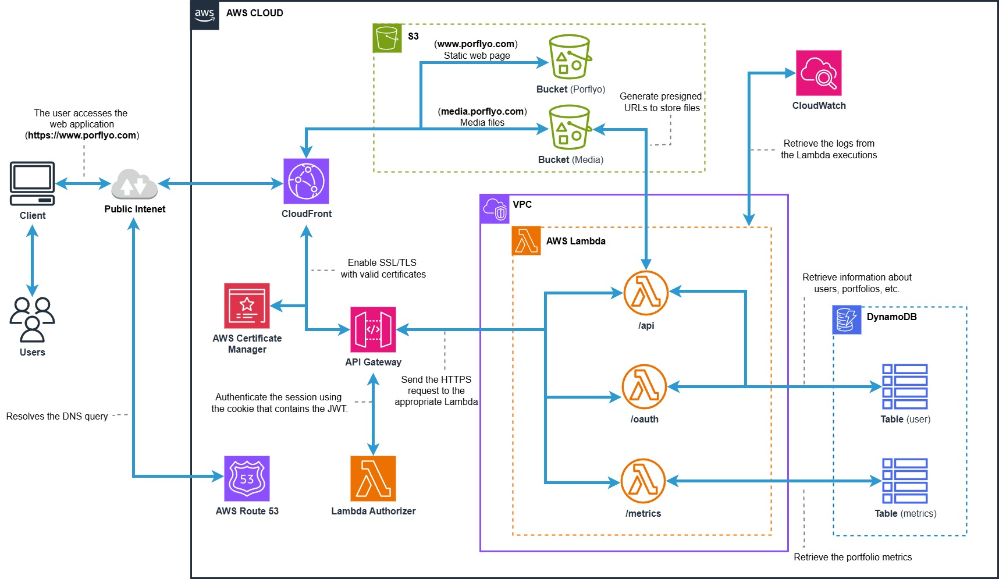

# Porflyo

Porflyo is a web platform that allows developers to generate and publish personal portfolios directly from their public GitHub repositories.  
It focuses not only on portfolio generation, but also on visitor analytics, interaction metrics, and performance insights.

The system is designed with hexagonal architecture, is deployed serverlessly on AWS, and uses DynamoDB to store both portfolio data and analytics. This approach ensures durability, scalability, and low operational overhead.

## Live Site

https://www.porflyo.com

## Key Features

- GitHub OAuth Integration  
  Users authenticate using their GitHub accounts. The platform fetches their public repositories and allows them to select up to 6 for the portfolio.

- Multiple Portfolios Per User  
  Each user can create multiple independent portfolios, each with its own configuration and layout.

- Save & Reuse Information  
   Users can save portfolio data and reuse it in future projects, streamlining the creation process.

- Draft & Publish Workflow 
  Users can save their portfolio configurations without publishing, allowing them to return and edit later.

- Custom Public URLs  
  Portfolios are published under a project-specific domain with user-personalized subpaths.

- Analytics & Metrics  
  Portfolios collect metrics such as visit count, device distribution, scroll depth, and time-based engagement.  
  Metrics are stored in DynamoDB and aggregated efficiently to avoid unnecessary write pressure.

- Zero Server Management  
  The backend runs on AWS Lambda, meaning no servers to maintain, patch, or scale manually.

## AWS

[](docs/aws-architecture.png)

## Architecture Overview

The backend follows a Hexagonal Architecture (Ports & Adapters):

```
 ┌──────────────────────────┐
 │        React Frontend    │
 │        (Vite, TS)        │
 └─────────┬────────────────┘
           │ HTTPS (REST + Cookies / JWT)
           ▼
   ┌────────────────────┐
   │ AWS API Gateway    │
   └───────┬────────────┘
           ▼
   ┌────────────────────┐
   │ AWS Lambda (Java)  │
   │ Micronaut Runtime  │
   └───────┬────────────┘
           ▼
   ┌────────────────────┐
   │   DynamoDB + S3    │
   └────────────────────┘
```

### Why Hexagonal Architecture?
- Clear separation between domain logic and infrastructure
- Enables testing the domain without AWS
- Future migration to another cloud or runtime is simpler

## Backend

- Language: Java 21
- Framework: Micronaut
- Runtime: AWS Lambda (via `micronaut-function-aws-api-proxy`)
- Build: Gradle
- Architecture: Hexagonal (Ports + Adapters)
- Storage: DynamoDB + S3
- Auth: GitHub OAuth 2.0 + JWT session cookies
- Deployment: Terraform + AWS SAM

### Running Locally
Requires a GitHub OAuth App and environment variables (see `envExample.json`).

#### Backend
```bash
cd core
sam build -t template-dev.yml
sam local start-api --port 8080 --env-vars env.json --warm-containers EAGER --container-host-interface 0.0.0.0
```

#### DynamoDB and S3 Local
```bash
cd core && docker compose -f compose.localstack.yml up
```

## Frontend

- Framework: React
- Language: TypeScript
- Bundler: Vite

### Running Locally

```bash
cd frontend
npm install
npm run dev
```

## Testing Strategy

| Type | Scope | Tools |
|------|-------|-------|
| Unit Tests | Domain use cases | JUnit 5, Mockito |
| Integration | Ports + Repositories | LocalStack, Testcontainers, WireMock |

## Deployment

Porflyo is deployed on AWS using the following services:

- Lambda
- API Gateway
- DynamoDB
- S3
- CloudFront
- Route 53
- ACM for TLS

Infrastructure is managed via Terraform, while SAM is used for local Lambda testing.

## License

```
Porflyo  
Copyright (C) 2025  M Clavo 

This program is free software: you can redistribute it and/or modify
it under the terms of the GNU Affero General Public License as published
by the Free Software Foundation, either version 3 of the License,
or any later version. 

This program is distributed in the hope that it will be useful, 
but WITHOUT ANY WARRANTY; without even the implied warranty of
MERCHANTABILITY or FITNESS FOR A PARTICULAR PURPOSE. 
See the GNU Affero General Public License for more details. 
<https://www.gnu.org/licenses/>
```

## Status

The project is under active development and currently part of an academic research project.

Not yet recommended for production use outside personal environments.
