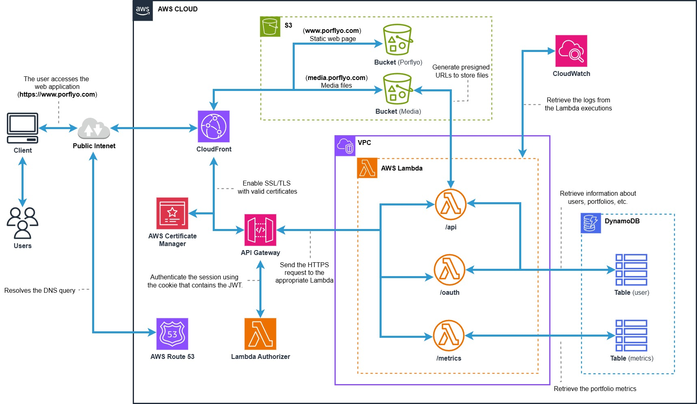
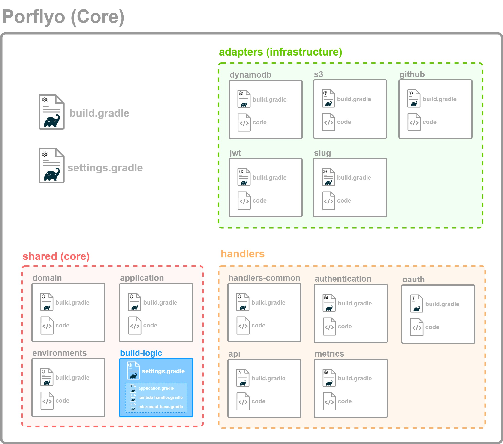
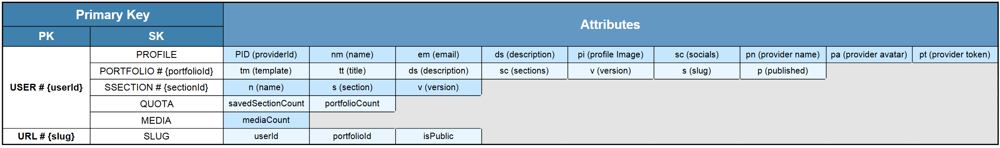
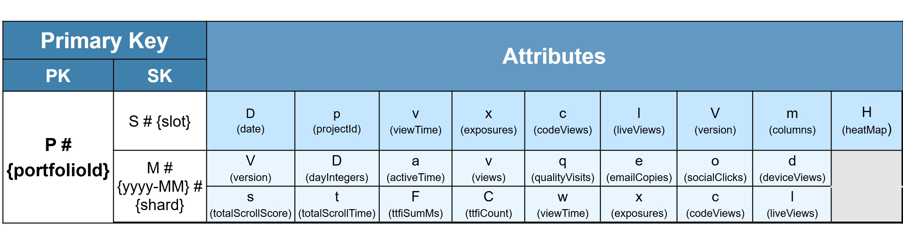
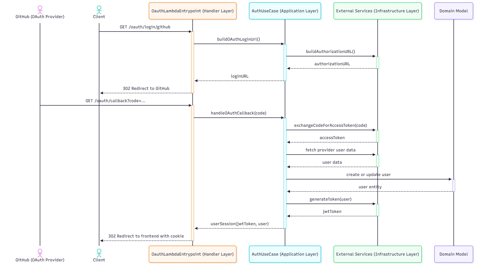

<div align="center">


# Porflyo
</div>

Porflyo is a serverless platform for creating and publishing personal developer portfolios from repository data. Users authenticate with GitHub, select public repositories, customize portfolio content, attach professional information, publish the result under a public URL, and inspect basic analytics about how visitors interact with their portfolio.

The project started as a final degree project, but the implementation is intentionally closer to a production-style backend than to a toy CRUD: it uses a hexagonal architecture, independent Lambda handlers, DynamoDB access patterns designed around cost constraints, infrastructure as code, local AWS emulation, and a testing strategy based on ports and adapters.


<h2 align="center">Interactive Editor</h2>
<p align="center">
  

</p>

<h2 align="center">Heatmap and Daily Metrics</h2>
<p align="center">
  
  
</p>

<h2 align="center">Drag and Drop</h2>
<p align="center">
  
  
</p>
<h2 align="center">AWS Architecture</h2>
<p align="center">
  
</p>

## Table of contents

- [Porflyo](#porflyo)
  - [Table of contents](#table-of-contents)
  - [What Porflyo does](#what-porflyo-does)
  - [Why Micronaut, Lambda and Native Images?](#why-micronaut-lambda-and-native-images)
    - [Why Not Spring Boot, Containers, Python or Go?](#why-not-spring-boot-containers-python-or-go)
  - [Architecture](#architecture)
  - [Backend Core](#backend-core)
    - [Shared Core](#shared-core)
    - [Adapters](#adapters)
    - [Handlers](#handlers)
    - [API Surfaces](#api-surfaces)
  - [Data Model](#data-model)
    - [User and Portfolio Table](#user-and-portfolio-table)
    - [Metrics Table](#metrics-table)
    - [Cost and Size Considerations](#cost-and-size-considerations)
  - [Metrics](#metrics)
  - [Security model](#security-model)
  - [Technology stack](#technology-stack)
    - [Backend](#backend)
    - [Frontend](#frontend)
    - [Infrastructure and DevOps](#infrastructure-and-devops)
    - [Testing and local tooling](#testing-and-local-tooling)
  - [Repository structure](#repository-structure)
  - [Local development](#local-development)
    - [Prerequisites](#prerequisites)
    - [Backend](#backend-1)
    - [Frontend](#frontend-1)
  - [Testing strategy](#testing-strategy)
  - [Deployment](#deployment)
  - [Engineering trade-offs](#engineering-trade-offs)
    - [Serverless over long-running services](#serverless-over-long-running-services)
    - [DynamoDB over a relational database](#dynamodb-over-a-relational-database)
    - [Hexagonal architecture over framework-driven layering](#hexagonal-architecture-over-framework-driven-layering)
    - [Independent Lambda handlers over a single backend artifact](#independent-lambda-handlers-over-a-single-backend-artifact)
    - [Low-cost operation as a first-class constraint](#low-cost-operation-as-a-first-class-constraint)
  - [Roadmap](#roadmap)
  - [License](#license)

## What Porflyo does

Porflyo solves a common problem for students and junior developers: having projects is not the same as having a clean, shareable, public portfolio. Building one manually requires frontend work, design decisions, hosting, domain configuration, deployment knowledge, and some kind of analytics if the user wants to know whether the portfolio is actually being seen.

The platform provides:

- GitHub-based authentication through OAuth 2.0.
- Import of public repositories from the authenticated user's GitHub account.
- Creation and editing of portfolios with custom project cards, descriptions, images, visual configuration, and templates.
- Public portfolio URLs that can be shared without requiring visitor authentication.
- Optional curriculum/profile information inside the portfolio.
- Anonymous visit and interaction metrics.
- Persistent storage for user data, portfolio data, media files, public URL mappings, and metrics.
- Serverless deployment on AWS with low operational cost as a design constraint.

> [!NOTE]
> In the current backend implementation, publishing means reserving a public slug and exposing portfolio data through public API endpoints. The inspected `/core` code does not generate static websites by itself; rendering is handled by the frontend.

## Why Micronaut, Lambda and Native Images?

Porflyo was designed under a strict cost constraint: keep the platform viable on AWS with very low idle cost and predictable usage-based billing. In the deployed environment, the monthly AWS cost stayed around ~0.50 USD under the observed project workload.

A container-based deployment would have been simpler in some areas, but it would also require always-on compute or a more expensive hosting model. AWS Lambda fits the usage pattern better: portfolio editing and public reads are intermittent, traffic can be bursty, and the backend should cost very little when nobody is using it.

Micronaut was chosen because it fits that serverless model particularly well. Unlike traditional reflection-heavy JVM frameworks, Micronaut performs dependency injection and much of its framework wiring at compile time. That reduces runtime overhead, improves startup behavior, and makes the application a better candidate for GraalVM native-image compilation.

The production Lambda artifacts are built as native images instead of regular JVM applications. This adds complexity to the build and deployment process, but it has clear runtime benefits for this project:

- smaller Lambda artifacts;
- lower memory pressure;
- faster startup behavior;
- lower cold-start impact;
- better fit for short-lived serverless execution;
- reduced cost risk under AWS Lambda’s pay-per-use model.

In the deployed setup, each native Lambda artifact stays under 50 MB, which keeps the packages small enough for the direct Lambda upload workflow used by the project. Hot starts are typically around the low hundreds of milliseconds, while cold starts usually stay below one second for the current workload and configuration.

These numbers are not meant to be universal benchmarks. They describe the behavior observed in this project with its current artifact size, AWS configuration, and traffic profile.

This decision also explains several other backend choices. DynamoDB data is modeled around predictable access patterns and compact item representations. Media upload uses S3 presigned URLs so large files do not pass through Lambda. Metrics are stored separately from user-facing data to isolate write-heavy analytics traffic. The system is intentionally optimized around Lambda, DynamoDB, S3, and CloudFront rather than around a traditional always-on backend.

### Why Not Spring Boot, Containers, Python or Go?

Spring Boot would have been a familiar and powerful choice, but Porflyo’s constraints made startup time, memory usage, and native-image friendliness more important than ecosystem size. Spring can run on Lambda and can also be compiled with GraalVM, but Micronaut required less framework workarounds for this specific serverless/native-image target.

A containerized backend would have simplified deployment and local parity, but it would also move the project away from the low-idle-cost model that motivated the architecture. For this project, paying mainly per request was more attractive than running always-on compute.

Python or Go would also be valid choices for serverless workloads. Go in particular would produce small and fast binaries. However, Porflyo was also a Java backend project, and Java 21 with Micronaut offered a good balance between strong typing, mature tooling, AWS integration, native-image support, and personal learning value.

## Architecture

Porflyo is built as a serverless AWS application. Static frontend assets and user media are stored in S3 and distributed through CloudFront. API Gateway routes backend traffic to Lambda functions. DynamoDB stores user, portfolio, URL, quota, media, and metrics data. CloudWatch is used for operational logs and debugging.

At runtime, the high-level flow is:

1. A user accesses the web application through the public domain.
2. CloudFront serves static frontend assets from S3.
3. Authenticated API requests go through API Gateway.
4. API Gateway validates requests and forwards them to the appropriate Lambda handler.
5. Lambda handlers execute application use cases from the backend core.
6. Adapters persist data in DynamoDB, store or retrieve media from S3, and call external services such as GitHub.
7. CloudWatch collects execution logs from the Lambda functions.

The backend follows a hexagonal architecture. Business rules live in the core and do not depend directly on AWS, HTTP, DynamoDB, S3, or GitHub. External systems are accessed through ports, and infrastructure modules provide concrete adapters.

That separation matters in this project because the infrastructure is not incidental. AWS costs, Lambda execution model, DynamoDB access patterns, GitHub OAuth, media storage, and local emulation all influence the implementation. Keeping those concerns outside the domain avoids turning the core into a pile of cloud SDK calls.

## Backend Core

The `/core` backend is a Java 21 Micronaut application organized as a Gradle multi-module project. Its structure follows a small hexagonal architecture: the domain and use cases live in shared modules, infrastructure integrations are implemented as adapters, and AWS Lambda entrypoints are isolated in handler modules.

<p align="center">
  
</p>

At a high level, the backend is split into three main areas:

| Area | Purpose |
| --- | --- |
| `shared` | Domain model, application use cases, ports, shared configuration, and Gradle convention logic. |
| `adapters` | Infrastructure implementations for external systems such as DynamoDB, S3, GitHub, JWT, and slug normalization. |
| `handlers` | AWS Lambda entrypoints that expose the backend through API Gateway routes. |

### Shared Core

The shared modules contain the backend code that should remain independent from a specific cloud provider or delivery mechanism.

| Module | Responsibility |
| --- | --- |
| `shared:domain` | Domain records, value objects, IDs, and domain exception types. |
| `shared:application` | Use cases, ports, DTOs, analytics utilities, quota configuration, JWT configuration, and metrics logic. |
| `shared:environments` | Shared Micronaut configuration and logging resources for local, test, integration, staging, and production environments. |
| `build-logic` | Shared Gradle convention logic used to keep module build files consistent. |

This is the part of the backend where most business rules live: users, provider accounts, portfolios, saved sections, public URLs, media references, quotas, and analytics calculations.

### Adapters

Adapters implement the ports defined by the application layer. Each adapter is isolated by technology so infrastructure concerns can evolve without leaking into the domain model or use cases.

| Module | Responsibility |
| --- | --- |
| `adapters:dynamodb` | DynamoDB repositories, item mappers, table schemas, and local/test table bootstrap logic. |
| `adapters:s3` | S3 media repository, S3 client configuration, presigned URL generation, and public URL building. |
| `adapters:github` | GitHub OAuth and GitHub API integration using Java `HttpClient`, including retry handling for transient failures. |
| `adapters:jwt` | HMAC-SHA256 JWT generation and verification using Nimbus JOSE JWT. |
| `adapters:slug` | Public URL slug normalization. |

The main persistence adapter uses DynamoDB, while media files are handled through S3. GitHub is treated as an external provider, not as part of the domain model, which keeps the authentication and repository-import flow separated from the core portfolio logic.

### Handlers

Handler modules contain the AWS Lambda entrypoints. Each handler exposes a specific backend surface and wires the required use cases with the corresponding adapters.

| Module | Responsibility |
| --- | --- |
| `handlers:handlers-common` | Shared Lambda utilities, response helpers, request parsing, and exception translation. |
| `handlers:oauth` | GitHub OAuth login and callback flow. |
| `handlers:authentication` | Session validation and logout behavior. |
| `handlers:api` | Authenticated user, repository, portfolio, saved section, media, and public portfolio operations. |
| `handlers:metrics` | Portfolio metrics ingestion and analytics retrieval. |

This separation keeps each Lambda deployable and testable in isolation while still reusing the same domain and application core.

### API Surfaces

The Lambda handlers expose four main API surfaces:

| Surface | Responsibility |
| --- | --- |
| OAuth | Redirects users to GitHub and handles the OAuth callback. |
| Authentication | Validates the `session` cookie and clears it during logout. |
| Core API | Handles users, repositories, portfolios, saved sections, media uploads, and public portfolio reads. |
| Metrics | Stores and retrieves engagement, scroll, heatmap, and project-level analytics. |

The result is a backend that is AWS-oriented at the edges, but keeps most business logic in provider-agnostic application modules.

## Data Model

Porflyo uses DynamoDB with a cost-aware NoSQL design. The backend separates core application data from analytics data because they have different access patterns, write frequency, and retention needs.

The DynamoDB adapter uses two configured physical tables:

| Table | Responsibility |
| --- | --- |
| `dynamodb.user-table` | Users, provider accounts, portfolios, saved sections, public slug mappings, media reference counts, quotas, and counters. |
| `dynamodb.metrics-table` | Portfolio analytics, monthly aggregate shards, rotating detail slots, heatmap data, scroll metrics, project metrics, and derived engagement data. |

### User and Portfolio Table

<p align="center">
  
</p>

The main table follows a single-table-style design using a composite key model (`PK`, `SK`). Related records are grouped around predictable access patterns instead of being modeled as separate relational tables.

The table stores the main user-facing entities:

- Users and GitHub provider accounts.
- Portfolio drafts and published portfolios.
- Portfolio sections, cards, and media references.
- Public URL mappings.
- Saved reusable sections.
- Per-user quotas and counters.
- Media reference counts used for cleanup.

Item keys use explicit prefixes such as `USER#`, `PORTFOLIO#`, `SSECTION#`, `URL#`, `MEDIA`, and `QUOTA`. This makes the physical model easier to inspect while still keeping related records colocated for efficient queries.

A `provider-user-id-index` GSI is used to resolve existing users from their GitHub identity during the OAuth flow.

Public slug reservation is handled through dedicated URL mapping records. This allows the backend to check and reserve public portfolio URLs without scanning portfolios or relying on eventually consistent application-side checks.

### Metrics Table
<p align="center">
  
</p>

Metrics are stored in a separate DynamoDB table because analytics traffic behaves differently from normal user and portfolio operations. A public portfolio can receive repeated metric writes without the user actively editing anything, so keeping analytics isolated protects the main table from unnecessary write pressure.

The metrics table stores:

- Portfolio-level engagement metrics.
- Scroll and interaction metrics.
- Heatmap data.
- Project-level metrics.
- Monthly aggregate shards.
- Rotating detail slots for recent high-volume data.
- Derived metrics such as z-scores and engagement-related calculations.

This separation keeps the core user experience independent from analytics ingestion. If metrics volume grows, the metrics model can be tuned, compacted, or retained differently without reshaping the main user/portfolio table.

### Cost and Size Considerations

The data model is intentionally compact. Some items use abbreviated attribute names and compact representations for high-volume or analytics-oriented data. This is a deliberate trade-off: the model favors lower item size and predictable DynamoDB capacity usage over maximum readability at the storage layer.

That decision fits the constraints of the project. Porflyo is designed to stay inexpensive under low-to-moderate traffic, so the persistence model avoids unnecessary tables, avoids relational-style joins, and keeps frequently accessed data aligned with DynamoDB query patterns.

The trade-off is that some persistence code is more specialized than it would be with a relational database. DynamoDB makes the common access paths cheap and scalable, but it requires careful key design, explicit mapping code, and discipline when adding new query patterns.

## Metrics

One of Porflyo's differentiating features is that generated portfolios are not just static pages. The platform collects anonymous interaction metrics so users can understand whether their portfolio is attracting attention and which parts are useful.

The documented metrics include:

- Total visits.
- Email copy events.
- Desktop vs. mobile/tablet distribution.
- Scroll engagement.
- Average scroll time.
- Average project/card view time.
- Time to first interaction.
- Quality visit rate.
- Project-level exposure and interaction data.
- Heatmap-related interaction data.
- Aggregated metrics across time windows.
- Normalized scores used to compare engagement signals.

The metrics system is intentionally aggregated and anonymous. The goal is to provide useful product feedback to the portfolio owner, not to track individual visitors.

## Security model

Authentication is built around GitHub OAuth and a backend-issued JWT. After the OAuth callback, the backend exchanges the GitHub code, creates or updates the internal user, stores the provider account server-side, and returns an HttpOnly `session` cookie. 

> [!NOTE]
> The cookie is still called `session` even though the backend is fully stateless.
>
> The original session-based design disappeared a long time ago. The cookie name survived somehow.

<p align="center">
  
</p>

The JWT is signed with HS256, uses `Porflyo` as issuer, stores the internal `userId` as subject, and includes issued-at and expiration claims. The GitHub access token is stored server-side and is not exposed through public user DTOs.

Security is also enforced at the infrastructure level:

- API Gateway is the public entry point for backend traffic.
- Lambda functions are not exposed directly.
- IAM roles follow the principle of least privilege.
- Secrets are not stored in source code.
- Public portfolio access is separated from authenticated management operations.
- User metrics are only visible to the portfolio owner.
- Logout clears the browser cookie but does not invalidate already-issued JWTs server-side.

## Technology stack

### Backend

- Java 21.
- Micronaut.
- AWS Lambda.
- AWS API Gateway.
- DynamoDB.
- S3.
- CloudWatch.
- SLF4J.
- JWT.
- Gradle multi-module/composite build.
- GraalVM/native-image support where applicable.

### Frontend

- TypeScript.
- React.
- npm.
- dnd-kit for drag-and-drop interactions.
- zustand for state management.
- Component-based UI structure.
- Portfolio templates and editor-oriented views.

### Infrastructure and DevOps

- CloudFormation for infrastructure as code.
- AWS SAM for local Lambda execution and validation.
- Route 53, ACM, CloudFront, S3, API Gateway, Lambda, DynamoDB, and IAM for the deployed AWS environment.

### Testing and local tooling

- JUnit 5.
- Mockito.
- WireMock.
- Docker.
- Testcontainers.
- LocalStack.
- Mockoon for local metrics/API simulation.

## Repository structure

The exact repository layout may evolve, but the backend core is designed around this structure:

```text
core/
├── shared/
│   ├── domain/
│   ├── application/
│   ├── environments/
│   └── build-logic/
├── adapters/
│   ├── dynamodb/
│   ├── s3/
│   ├── github/
│   ├── jwt/
│   └── slug/
└── handlers/
    ├── handlers-common/
    ├── authentication/
    ├── oauth/
    ├── api/
    └── metrics/
```

The frontend is organized separately around a component-based React architecture, with directories for API access, reusable components, styles, templates, and views.

## Local development

### Prerequisites

- Java 21.
- Gradle wrapper included in the repository.
- Docker Desktop or a compatible Docker runtime.
- AWS SAM CLI.
- Node.js and npm for the frontend.
- An AWS account for real deployments.
- A GitHub OAuth application for authentication flows.

### Backend

```
cd core
.\gradlew.bat build
docker compose -f compose.localstack.yml up -d

Copy-Item envExample.json env.json

sam build --template-file template-dev.yml
sam local start-api --template-file template-dev.yml --env-vars env.json
```

From Windows PowerShell:

```powershell
cd core
.\gradlew.bat clean build
Copy-Item envExample.json env.json
```

On Linux/macOS:

```bash
cd core
./gradlew clean build
cp envExample.json env.json
```

Then, for Lambda-style local execution, use AWS SAM from the directory that contains the SAM template:

```bash
sam build --template-file template-dev.yml
sam local start-api --template-file template-dev.yml --env-vars env.json
```

The project uses local emulation where possible. DynamoDB and S3 integrations can be tested through LocalStack/Testcontainers instead of requiring live AWS services for every development cycle.

### Frontend

```powershell
npm install
npm run dev
```

Use the frontend environment configuration to point the app either to the local SAM API, a staging API, or the production API.

## Testing strategy

The backend testing strategy follows the architecture rather than fighting it.

Domain and application tests validate business behavior without depending on AWS. Adapter tests validate that a real implementation satisfies the port contract. Integration tests use Testcontainers and LocalStack for realistic DynamoDB/S3 behavior. WireMock is used for HTTP integrations such as GitHub OAuth/API flows.

A notable design choice is the use of abstract contract tests for ports. Each adapter can extend the same contract test suite, which makes it harder for infrastructure implementations to drift away from the behavior expected by the application layer.

The trade-off is maintenance cost. When a port changes, the contract tests must change with it. In exchange, the architecture gets a useful safety net around the most important boundary in the system.

## Deployment

Porflyo includes AWS infrastructure definitions under `infra/`, written with CloudFormation. The infrastructure covers the main AWS resources used by the platform, including the serverless backend and the public hosting/CDN layer.

The project has been deployed using separate staging and production environments. Staging was used to validate infrastructure changes and backend behavior before promoting them to production.

Deployment is currently not implemented as a public CI/CD pipeline. Native Lambda artifacts are built locally and then deployed against the CloudFormation stacks. This is intentional for the current state of the project: GraalVM native-image builds are relatively expensive, take several minutes per Lambda, and were more reliable to run on a controlled local machine than inside a long GitHub Actions workflow.

Only the reusable infrastructure definitions are committed. Environment-specific deployment orchestration is kept outside the repository.

> [!NOTE]
> After enough failed CI native builds, local compilation started feeling less like a workaround and more like a survival strategy. Do you also hear elevator music when you think about a 10-minute CI build that might fail at the end? No? Just me?

## Engineering trade-offs

### Serverless over long-running services

Serverless keeps operational cost low and scales naturally for irregular traffic. The cost is increased complexity in local debugging, cold starts, observability, IAM configuration, and infrastructure design.

### DynamoDB over a relational database

DynamoDB fits the Lambda execution model and low-cost target well. It also forces the data model to be designed around access patterns. That makes reads and writes efficient, but it reduces ad-hoc querying flexibility and requires more upfront modeling.

### Hexagonal architecture over framework-driven layering

Ports and adapters make the core easier to test and protect business logic from AWS-specific implementation details. The cost is more modules, more interfaces, and a slightly higher initial complexity.

### Independent Lambda handlers over a single backend artifact

Separate handlers keep deployment boundaries small and allow each function to evolve independently. The downside is more build/deployment wiring and more care needed around shared configuration.

### Low-cost operation as a first-class constraint

Several decisions, especially around DynamoDB item size, binary encoding, aggregation, and metrics storage, are influenced by AWS free-tier/cost constraints. This makes the system more efficient, but also less straightforward than a naive relational implementation.

## Roadmap

Possible improvements:

- Add more portfolio templates.
- Add SES-based contact form functionality.
- Improve the portfolio editor experience.
- Expand the metrics dashboard with clearer trend analysis.
- Add export/import flows for portfolio data.
- Refine media optimization and cleanup workflows.
- Add deeper observability with traces if cost allows it.
- Continue hardening infrastructure permissions and deployment validation.
- Improve documentation for local setup and environment-specific configuration.

## License

Porflyo is distributed under the GNU Affero General Public License v3.0 or later.

See [`LICENSE`](LICENSE) for details.
